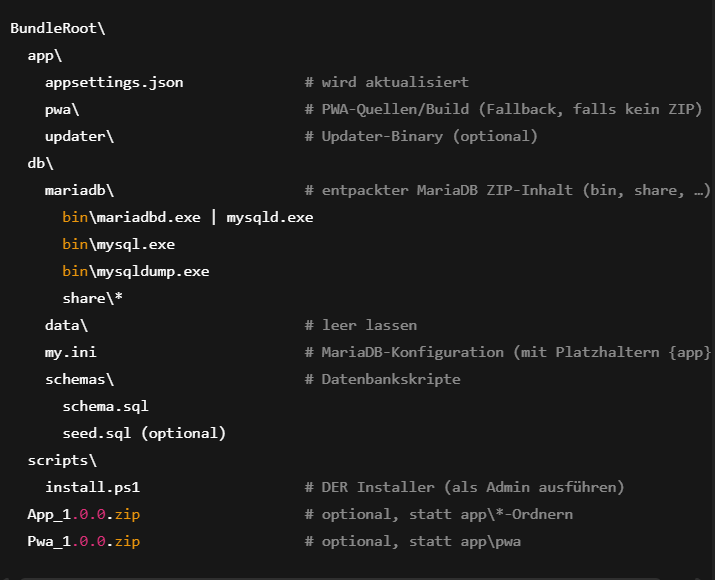
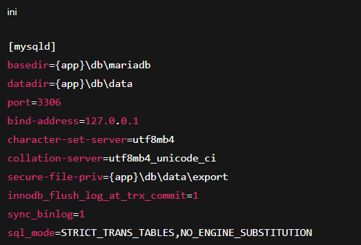

# GreenKasse – Installer-Handbuch (installer.md)
Dieses Dokument beschreibt, wie der automatische
Installer (scripts\install.ps1) für GreenKasse verwendet wird, 
was er installiert.

## Überblick
#### Der Installer:

- entpackt die App und die PWA in C:\ProgramData\GreenKasse\packages\...
- erstellt Junctions (current) nach C:\Program Files\GreenKasse\App und C:\ProgramData\GreenKasse\content\pwa
- kopiert MariaDB (ZIP, portable) nach C:\Program Files\GreenKasse\db, setzt die Daten nach C:\ProgramData\GreenKasse\db\data
- initialisiert die Datenbank, generiert ein starkes Passwort, legt DB greenKasse und User lsa an
- importiert optional schema.sql / seed.sql
- aktualisiert appsettings.json (WebRoot & ConnectionStrings.MariaDb)
- richtet URL ACL und Firewall-Regel ein

erstellt Windows-Dienste:

- GreenKasseDB (MariaDB)
- GreenKasse App (.NET Backend)
- GreenKasse Updater (optional)

### Startverzeichnis: BundleRoot

### Hinweis
Der Installer kann sowohl ZIPs als auch Ordner als Quelle verwenden (ZIP hat Vorrang, sonst Fallback auf Ordner).

### Voraussetzungen
- Windows 10/11 (x64) oder Windows Server (x64)
- Administratorrechte (PowerShell als Admin öffnen)
- Entpackte MariaDB ZIP (LTS, z. B. 11.4.x) unter db\mariadb
- Optional: App_1.0.0.zip und Pwa_1.0.0.zip im BundleRoot – andernfalls werden app\ und app\pwa\ verwendet

### Installation
- Öffnen Sie PowerShell als Administrator.
- Navigieren Sie in den BundleRoot-Ordner.
- Führen Sie aus:.\scripts\install.ps1
#### Nach erfolgreichem Lauf:
- Backend-Dienst GreenKasse App läuft
- Datenbankdienst GreenKasseDB läuft
- GreenKasse Updater läuft
- App erreichbar unter: http://localhost:8080/

### GreenKasse als App-Icon installieren

Nach der Installation öffnet der Installer automatisch die Oberfläche unter `http://localhost:<PORT>/`.
Die PWA wird vom Backend direkt ausgeliefert. Um die PWA als **App-Icon** zu installieren:

1. Öffne die Seite im **Microsoft Edge** oder **Google Chrome**.
2. Klicke auf **„App installieren”** (Symbol in der Adressleiste) bzw. im Menü **„Als App installieren”**.
3. Bestätige den Dialog. Danach erscheint ein **eigenes App-Fenster** und ein **Icon** im Startmenü/Taskleiste.

## Was macht das Skript genau?

###### Verzeichnisse anlegen:
- C:\Program Files\GreenKasse\{App,Updater,db}
- C:\ProgramData\GreenKasse\{packages,content\pwa,session,cache,logs,db\data}
###### Pakete:
- App/PWA aus ZIP oder aus app\ / app\pwa\ kopieren
###### erstellt current-Junctions:
- C:\Program Files\GreenKasse\App\current → C:\ProgramData\GreenKasse\packages\app\<Version>
- C:\ProgramData\GreenKasse\content\pwa\current → ...\packages\pwa\<Version>

###### MariaDB:
- kopiert MariaDB nach C:\Program Files\GreenKasse\db
- ersetzt in my.ini die Platzhalter {app} → reale Pfade:
- basedir = C:\Program Files\GreenKasse\db\mariadb
- datadir = C:\ProgramData\GreenKasse\db\data
- secure-file-priv = C:\ProgramData\GreenKasse\db\data\export
- setzt NT AUTHORITY\LOCAL SERVICE Schreibrechte auf datadir
- initialisiert DB (--initialize-insecure)

###### erstellt Dienst GreenKasseDB und startet ihn
- setzt Root-Passwort (zufällig), legt greenKasse + User lsa an, vergibt Rechte
- importiert schema.sql / seed.sql (falls vorhanden)

###### Konfiguration:
- aktualisiert appsettings.json:
- WebRoot = C:\ProgramData\GreenKasse\content\pwa\current
- ConnectionStrings.MariaDb = Server=localhost;Port=3306;Database=greenKasse;User=lsa;Password=<GENERIERT>;TreatTinyAsBoolean=true;

###### Netzwerk/OS:
- netsh http add urlacl für http://+:8080/ (LocalService)
- Windows-Firewallregel für Port 8080

###### installiert/konfiguriert Dienste GreenKasse App und  GreenKasse Updater

### Wichtige Daten 
#### db\my.ini
